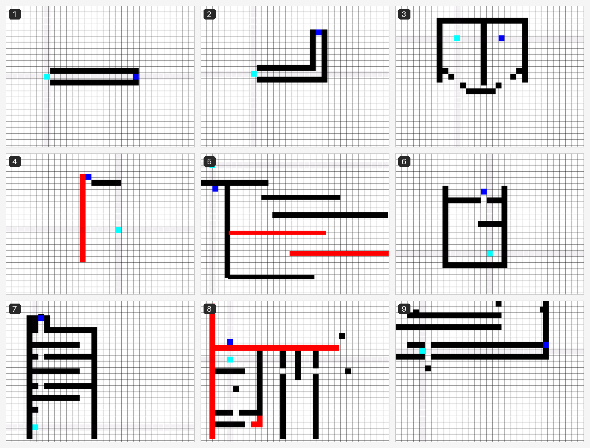

# Wallstop

A tiny click-to-move puzzle game made in GameMaker. You are a cyan square that cannot move on its own. The only thing you can do is drop a wall somewhere in a straight line from you, and the square slides toward it until it hits something. Get to the blue square. Do not touch the red ones.



*All nine levels. Cyan is you, blue is the exit, black is wall, red sends you back to the start.*

## How to play

While you are stopped, a faint pink crosshair marks the four lines you can travel along.

1. **Left-click on one of the pink lines.** A black wall appears on that line where you clicked.
2. Your square slides toward it and stops flush against the first wall it hits, whether that is the one you just placed or one that is part of the level.
3. The crosshair comes back, and you pick your next move.

That is the whole game. Because you can only stop by running into something, every move is really two decisions: which direction, and where to put the brake. Walls you place stay for the rest of the attempt, so they can help you (or get in your way) later on.

Touching red restarts the level. Touching blue takes you to the next one. Both count even if you only pass over them mid-slide.

| Input | What it does |
| --- | --- |
| Left-click on a pink line | Place a wall there and slide toward it |
| R | Restart the current level (this also clears any walls you placed) |

### Menus and progress

- **Start Game** opens the level select. **How to play** shows the rules with three little looping demos. **Reset** wipes your saved progress.
- The first time you reach a new level, the game sends you back to the level select with that level freshly unlocked; click it to play. Replaying levels you have already reached chains straight from one into the next.
- Progress (the highest level reached) is saved automatically to `save.sav` in GameMaker's sandboxed save folder for the game.
- The end screen works the same way: finishing level 9 for the first time marks it cleared and returns you to the level select. Play level 9 again to see it.

## Running it

You need a current GameMaker release. The project was converted from an old GameMaker Studio 1.x project into the current project format, which older IDEs (including the 2022 LTS) cannot open.

1. Clone the repo:
   ```
   git clone https://github.com/Sicatho/wallstop.git
   ```
2. Open `Wallstop.yyp` in GameMaker.
3. Press **Run** (F5) to play in the IDE, or use **Build > Create Executable** for a standalone build.

There is nothing else to install: the project has no extensions, sounds, fonts, shaders, tilesets or included files. Everything is sprites, objects, rooms and three GML scripts.

## Project layout

```
Wallstop.yyp              GameMaker project file (open this)
objects/                  One folder per object; each event is a .gml file
  obj_plr/                The cyan player square; the state machine in Step_0.gml is the whole game
  obj_wall/               Black wall: pre-placed in levels (often stretched into bars) and spawned by clicking
  obj_evil/               Red hazard: restarts the level on contact
  obj_portal/             Blue exit: goes to the next room
  obj_pink/               The pink crosshair shown while the player is stopped
  obj_controller/         Persistent; loads progress from save.sav and handles the R key
  obj_rm_001 .. obj_rm_009   Level select buttons
  obj_start_game/, obj_help/, obj_reset/, obj_back/   Menu buttons
  obj_moveAround/, obj_death/, obj_goal/              Animated demos on the help screen
rooms/                    rm_main, rm_level_select, rm_help, rm_001 .. rm_009, rm_end.
                          rm_002 .. rm_009 and rm_end have a RoomCreationCode.gml that
                          bumps the saved progress on first entry
scripts/                  Three compatibility shims generated by GameMaker's GMS1 importer
                          (instance_create, object_get_depth, __global_object_depths). Keep them.
sprites/                  All artwork, including every level-select button state
notes/                    The importer's compatibility report
docs/levels.png           The contact sheet above, rendered from the room data
```

Rooms are 1024x768 and the game runs at 30 fps. Room order in the `.yyp` matters: `room_goto_next()` carries you from each level's portal into the next room, so a new level goes before `rm_end`.

`Wallstop.resource_order` is regenerated by the IDE and is gitignored.

## Credits and license

Made by Usman Siddiqui ([Sicatho](https://github.com/Sicatho)).

Released under the MIT License. See [LICENSE](LICENSE).
